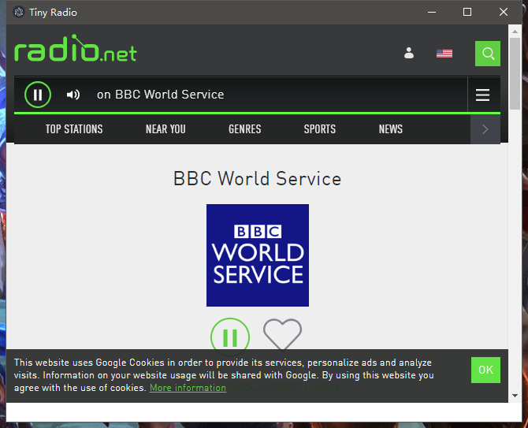

# tiny-radio


Buy me a cup of coffee for $3

[](https://ko-fi.com/M4M54KKIF)

A windows pc client for radio.net


## Preview




## Development

Please make sure `yarn` installed first.

You need nodejs installed, then run `yarn install && yarn start` to try this in dev mode,

If you want to build native executable binary , you need `electron-builder`.

```
yarn global add electron-builder
./bin/build.sh
```

## Donate me please

### Bitcoin donate

```
136MYemy5QmmBPLBLr1GHZfkES7CsoG4Qh
```
### Alipay donate


**Scan QRCode donate me via Alipay**
